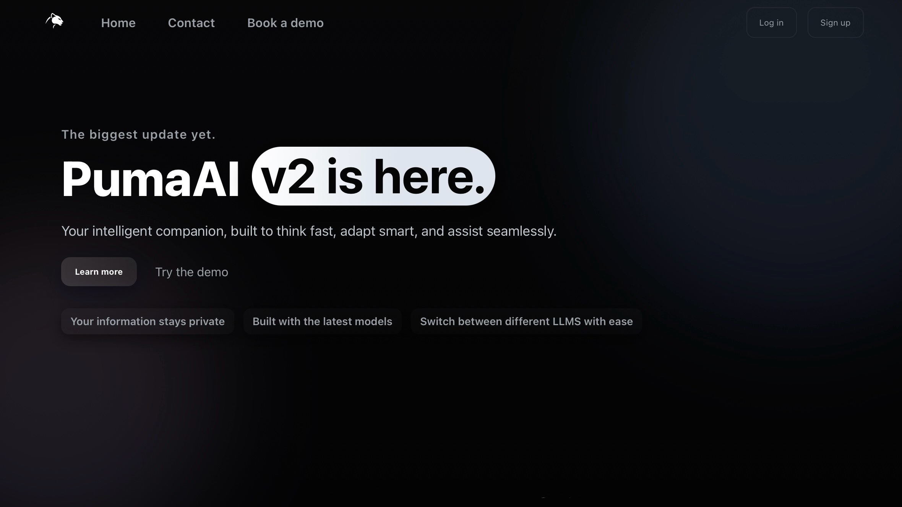

# PumaAI - Your Platform for AI



## 🚀 Overview

PumaAI is a modern, intelligent AI assistant platform built with React and powered by OpenAI's GPT models. It features a sleek dark theme, responsive design, and comprehensive dashboard for managing AI conversations, settings, and user analytics.

## ✨ Features

- **🤖 AI Assistant**: Real-time chat with OpenAI GPT integration
- **💬 Multi-Chat Support**: Manage multiple conversation threads
- **⚡ Quick Actions**: Pre-defined prompts for common tasks
- **📊 Usage Analytics**: Track your AI interactions and usage patterns
- **🔧 Model Switching**: Choose between different AI models
- **🔒 Privacy Controls**: Comprehensive privacy settings and data management
- **🎨 Modern UI**: Glass morphism design with dark theme
- **📱 Responsive**: Works seamlessly on desktop and mobile devices
- **🔐 Authentication**: Secure user authentication system

## 🛠️ Technology Stack

- **Frontend**: React 19 with Vite
- **Routing**: React Router DOM v7
- **Styling**: Modern CSS with CSS Grid and Flexbox
- **AI Integration**: OpenAI GPT API
- **Deployment**: GitHub Pages
- **Build Tool**: Vite

## 🚀 Quick Start

### Prerequisites

- Node.js 18+ and npm
- OpenAI API key (for full AI functionality)

### Installation

1. **Clone the repository**
   ```bash
   git clone https://github.com/PumaAI-v2/homepage.git
   cd homepage/homepage
   ```

2. **Install dependencies**
   ```bash
   npm install
   ```

3. **Set up environment variables**
   ```bash
   cp .env.example .env
   ```
   
   Edit `.env` and add your API keys:
   ```env
   VITE_OPENAI_API_KEY=your_openai_api_key_here
   VITE_OPENAI_API_URL=https://api.openai.com/v1
   VITE_APP_NAME=PumaAI
   VITE_ENVIRONMENT=development
   ```

4. **Start development server**
   ```bash
   npm run dev
   ```

5. **Open in browser**
   Navigate to `http://localhost:5173`

### Production Build

```bash
npm run build
npm run preview  # Preview the production build locally
```

### Deploy to GitHub Pages

```bash
npm run deploy
```

## 🔧 Configuration

### Environment Variables

Create a `.env` file in the `homepage` directory with the following variables:

```env
# Required for AI functionality
VITE_OPENAI_API_KEY=your_openai_api_key_here

# Optional configurations
VITE_GOOGLE_ANALYTICS_ID=your_ga_id_here
VITE_APP_VERSION=2.0.0
VITE_ENVIRONMENT=production

# Feature flags
VITE_ENABLE_OPENAI=true
VITE_ENABLE_ANALYTICS=true
```

### API Keys Setup

1. **OpenAI API Key**:
   - Go to [OpenAI Platform](https://platform.openai.com/api-keys)
   - Create a new API key
   - Add it to your `.env` file as `VITE_OPENAI_API_KEY`

2. **Google Analytics** (Optional):
   - Set up a Google Analytics 4 property
   - Add the Measurement ID to `VITE_GOOGLE_ANALYTICS_ID`

## 📁 Project Structure

```
homepage/
├── public/                 # Static assets
├── src/
│   ├── components/        # React components
│   │   ├── dashboard/     # Dashboard-specific components
│   │   ├── Footer.jsx     # Site footer
│   │   ├── Hero.jsx       # Landing page hero
│   │   ├── Login.jsx      # Authentication components
│   │   └── Register.jsx
│   ├── contexts/          # React contexts
│   ├── services/          # API services
│   ├── config/            # Configuration files
│   ├── App.jsx           # Main app component
│   └── main.jsx          # App entry point
├── .env.example          # Environment variables template
├── vite.config.js        # Vite configuration
└── package.json          # Dependencies and scripts
```

## 🎯 Dashboard Features

### AI Assistant
- Real-time chat with OpenAI GPT
- Multiple conversation threads
- Quick action buttons for common prompts
- Message history and context awareness

### Settings
- User profile management
- API key configuration
- Theme and display preferences
- Notification settings

### Usage Statistics
- Chat activity tracking
- API usage monitoring
- Response time analytics
- Cost tracking (when applicable)

### Model Switching
- Choose between GPT models
- Temperature and parameter controls
- Custom system prompts

### Privacy & Security
- Data retention controls
- Export conversation history
- Delete account functionality
- Privacy-first design

## 🚀 Deployment

### GitHub Pages (Recommended)

1. **Set up repository secrets**:
   - Go to repository Settings > Secrets and variables > Actions
   - Add `OPENAI_API_KEY` with your OpenAI API key
   - Add other production environment variables as needed

2. **Enable GitHub Pages**:
   - Go to repository Settings > Pages
   - Set source to "GitHub Actions"

3. **Push to main branch**:
   ```bash
   git push origin main
   ```

The site will automatically deploy via GitHub Actions.

### Custom Deployment

Build the project and deploy the `dist` folder to any static hosting service:

```bash
npm run build
# Upload the 'dist' folder to your hosting provider
```

## 🤝 Contributing

1. Fork the repository
2. Create a feature branch (`git checkout -b feature/amazing-feature`)
3. Commit your changes (`git commit -m 'Add amazing feature'`)
4. Push to the branch (`git push origin feature/amazing-feature`)
5. Open a Pull Request

## 📝 License

This project is licensed under the MIT License - see the LICENSE file for details.

## 🆘 Support

- **Issues**: Report bugs and request features via [GitHub Issues](https://github.com/PumaAI-v2/homepage/issues)
- **Documentation**: Check this README and inline code comments
- **Community**: Join discussions in the repository

## 🔮 Roadmap

- [ ] Real-time collaboration features
- [ ] Voice chat integration
- [ ] Plugin system for custom tools
- [ ] Advanced analytics dashboard
- [ ] Mobile app companion
- [ ] Enterprise authentication (SSO)
- [ ] Custom AI model fine-tuning
- [ ] API for third-party integrations

---

**Built with ❤️ by the PumaAI team**
